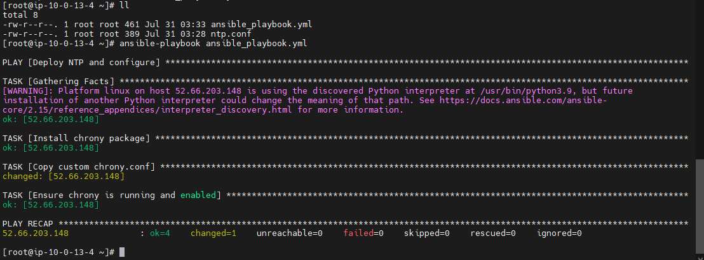

# Solution Configuration Management

### Answer - 1

```
Command: ansible client -m setup
```


### Answer - 2

```
Command: */10 2-4 * * * /usr/sbin/logrotate /etc/logrotate.conf
```

### Answer - 3

chrony install via ansible


I have uploaded the playbook file so you can change the hosts information and modify the ntp.conf file as par your requirements. Then you can run the below command to run the ansible playbook.

```
anisble-playbook ansible_playbook.yml
```

Note: I have used chrony because ntp package not being available in the default repositories on some Linux distributions, especially newer versions, where ntp has been replaced by chrony.

Need to install Nagios and modify the conf file.

1. Install Dependencies

```
sudo yum install -y httpd php gcc glibc glibc-common gd gd-devel make net-snmp unzip
```

2. Download and Extract Nagios Core

```
cd /tmp
wget https://assets.nagios.com/downloads/nagioscore/releases/nagios-4.4.6.tar.gz
tar xzf nagios-4.4.6.tar.gz
```

3. Compile and Install Nagios Core

```
cd nagios-4.4.6
./configure --with-command-group=nagcmd
make all
sudo make install
sudo make install-init
sudo make install-commandmode
sudo make install-config
sudo make install-webconf
```

4. Create Nagios User and Group

```
sudo groupadd nagcmd
sudo useradd nagios -g nagcmd
sudo usermod -a -G nagcmd nagios
```

5. Set Up Nagios Admin User

```
sudo htpasswd -bc /usr/local/nagios/etc/htpasswd.users nagiosadmin nagiosadminpassword
```

6. Start and Enable Services

```
sudo systemctl start httpd
sudo systemctl enable httpd
sudo systemctl start nagios
sudo systemctl enable nagios
```

Configuration Files

1. nagios.cfg

```
cfg_dir=/usr/local/nagios/etc/servers
```

2. Host Configuration
   Create a configuration file for your client machine, e.g., /usr/local/nagios/etc/servers/client_machine.cfg:

```
define host {
    use             linux-server
    host_name       client_machine
    alias           Client Machine
    address         52.66.203.148
    check_command   check-ping
    max_check_attempts 5
    check_period    24x7
    notification_interval 30
    notification_period   24x7
}
```

3. Service Configuration
   /usr/local/nagios/etc/servers/ntp_service.cfg:

```
define service {
    use                     generic-service
    host_name               client_machine
    service_description     ntp_process
    check_command           check_ntp
    check_interval          10
    retry_interval          2
    max_check_attempts      5
    check_period            24x7
    notification_interval   30
    notification_period     24x7
}
```

4. Verify Configuration

```
sudo /usr/local/nagios/bin/nagios -v /usr/local/nagios/etc/nagios.cfg
```

5. Restart Nagios

```
sudo systemctl restart nagios
```
